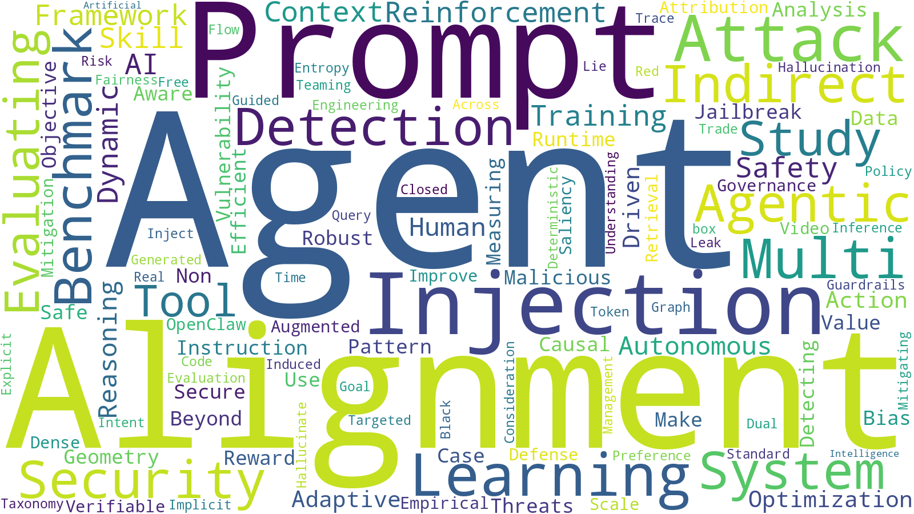

## Updated on 2026.03.13

  
Table of Contents

  <ol>
    <li><a href=#llm-safety>LLM Safety</a></li>
    <li><a href=#llm-alignment>LLM Alignment</a></li>
    <li><a href=#llm-hallucination>LLM Hallucination</a></li>
    <li><a href=#llm-privacy>LLM Privacy</a></li>
  </ol>

## Recent Title Word Cloud (100 Papers)

## LLM Safety

|Publish Date|Title|Authors|PDF|Code|
|---|---|---|---|---|
|**2026-03-12**|**Security Considerations for Artificial Intelligence Agents**|Ninghui Li et.al.|[2603.12230](http://arxiv.org/abs/2603.12230)|null|
|**2026-03-12**|**The Mirror Design Pattern: Strict Data Geometry over Model Scale for Prompt Injection Detection**|J Alex Corll et.al.|[2603.11875](http://arxiv.org/abs/2603.11875)|null|
|**2026-03-12**|**OpenClaw PRISM: A Zero-Fork, Defense-in-Depth Runtime Security Layer for Tool-Augmented LLM Agents**|Frank Li et.al.|[2603.11853](http://arxiv.org/abs/2603.11853)|null|
|**2026-03-12**|**Taming OpenClaw: Security Analysis and Mitigation of Autonomous LLM Agent Threats**|Xinhao Deng et.al.|[2603.11619](http://arxiv.org/abs/2603.11619)|null|
|**2026-03-12**|**Follow the Saliency: Supervised Saliency for Retrieval-augmented Dense Video Captioning**|Seung hee Choi et.al.|[2603.11460](http://arxiv.org/abs/2603.11460)|null|
|**2026-03-11**|**Jailbreak Scaling Laws for Large Language Models: Polynomial-Exponential Crossover**|Indranil Halder et.al.|[2603.11331](http://arxiv.org/abs/2603.11331)|null|
|**2026-03-11**|**AttriGuard: Defeating Indirect Prompt Injection in LLM Agents via Causal Attribution of Tool Invocations**|Yu He et.al.|[2603.10749](http://arxiv.org/abs/2603.10749)|null|
|**2026-03-11**|**IH-Challenge: A Training Dataset to Improve Instruction Hierarchy on Frontier LLMs**|Chuan Guo et.al.|[2603.10521](http://arxiv.org/abs/2603.10521)|null|
|**2026-03-10**|**Compatibility at a Cost: Systematic Discovery and Exploitation of MCP Clause-Compliance Vulnerabilities**|Nanzi Yang et.al.|[2603.10163](http://arxiv.org/abs/2603.10163)|null|
|**2026-03-08**|**VoiceSHIELD-Small: Real-Time Malicious Speech Detection and Transcription**|Sumit Ranjan et.al.|[2603.07708](http://arxiv.org/abs/2603.07708)|null|
|**2026-03-10**|**Governance Architecture for Autonomous Agent Systems: Threats, Framework, and Engineering Practice**|Yuxu Ge et.al.|[2603.07191](http://arxiv.org/abs/2603.07191)|null|
|**2026-03-04**|**Beyond Input Guardrails: Reconstructing Cross-Agent Semantic Flows for Execution-Aware Attack Detection**|Yangyang Wei et.al.|[2603.04469](http://arxiv.org/abs/2603.04469)|null|
|**2026-03-03**|**Benchmark of Benchmarks: Unpacking Influence and Code Repository Quality in LLM Safety Benchmarks**|Junjie Chu et.al.|[2603.04459](http://arxiv.org/abs/2603.04459)|null|
|**2026-03-04**|**Image-based Prompt Injection: Hijacking Multimodal LLMs through Visually Embedded Adversarial Instructions**|Neha Nagaraja et.al.|[2603.03637](http://arxiv.org/abs/2603.03637)|null|
|**2026-03-04**|**Goal-Driven Risk Assessment for LLM-Powered Systems: A Healthcare Case Study**|Neha Nagaraja et.al.|[2603.03633](http://arxiv.org/abs/2603.03633)|null|
|**2026-03-03**|**Learning When to Act or Refuse: Guarding Agentic Reasoning Models for Safe Multi-Step Tool Use**|Aradhye Agarwal et.al.|[2603.03205](http://arxiv.org/abs/2603.03205)|null|
|**2026-03-02**|**DualSentinel: A Lightweight Framework for Detecting Targeted Attacks in Black-box LLM via Dual Entropy Lull Pattern**|Xiaoyi Pang et.al.|[2603.01574](http://arxiv.org/abs/2603.01574)|null|
|**2026-03-01**|**Tracking Capabilities for Safer Agents**|Martin Odersky et.al.|[2603.00991](http://arxiv.org/abs/2603.00991)|null|
|**2026-02-28**|**From Goals to Aspects, Revisited: An NFR Pattern Language for Agentic AI Systems**|Yijun Yu et.al.|[2603.00472](http://arxiv.org/abs/2603.00472)|null|
|**2026-02-27**|**LiaisonAgent: An Multi-Agent Framework for Autonomous Risk Investigation and Governance**|Chuanming Tang et.al.|[2603.00200](http://arxiv.org/abs/2603.00200)|null|
|**2026-02-26**|**Reverse CAPTCHA: Evaluating LLM Susceptibility to Invisible Unicode Instruction Injection**|Marcus Graves et.al.|[2603.00164](http://arxiv.org/abs/2603.00164)|null|
|**2026-02-27**|**SwitchCraft: Training-Free Multi-Event Video Generation with Attention Controls**|Qianxun Xu et.al.|[2602.23956](http://arxiv.org/abs/2602.23956)|null|
|**2026-02-26**|**AgentSentry: Mitigating Indirect Prompt Injection in LLM Agents via Temporal Causal Diagnostics and Context Purification**|Tian Zhang et.al.|[2602.22724](http://arxiv.org/abs/2602.22724)|null|
|**2026-02-25**|**Silent Egress: When Implicit Prompt Injection Makes LLM Agents Leak Without a Trace**|Qianlong Lan et.al.|[2602.22450](http://arxiv.org/abs/2602.22450)|null|
|**2026-02-24**|**Analysis of LLMs Against Prompt Injection and Jailbreak Attacks**|Piyush Jaiswal et.al.|[2602.22242](http://arxiv.org/abs/2602.22242)|null|
|**2026-02-24**|**SoK: Agentic Skills -- Beyond Tool Use in LLM Agents**|Yanna Jiang et.al.|[2602.20867](http://arxiv.org/abs/2602.20867)|null|
|**2026-02-24**|**AdapTools: Adaptive Tool-based Indirect Prompt Injection Attacks on Agentic LLMs**|Che Wang et.al.|[2602.20720](http://arxiv.org/abs/2602.20720)|null|
|**2026-02-24**|**ICON: Indirect Prompt Injection Defense for Agents based on Inference-Time Correction**|Che Wang et.al.|[2602.20708](http://arxiv.org/abs/2602.20708)|null|
|**2026-02-25**|**Skill-Inject: Measuring Agent Vulnerability to Skill File Attacks**|David Schmotz et.al.|[2602.20156](http://arxiv.org/abs/2602.20156)|null|
|**2026-02-23**|**The LLMbda Calculus: AI Agents, Conversations, and Information Flow**|Zac Garby et.al.|[2602.20064](http://arxiv.org/abs/2602.20064)|null|
|**2026-02-23**|**CIBER: A Comprehensive Benchmark for Security Evaluation of Code Interpreter Agents**|Lei Ba et.al.|[2602.19547](http://arxiv.org/abs/2602.19547)|null|
|**2026-02-19**|**Trojan Horses in Recruiting: A Red-Teaming Case Study on Indirect Prompt Injection in Standard vs. Reasoning Models**|Manuel Wirth et.al.|[2602.18514](http://arxiv.org/abs/2602.18514)|null|
|**2026-02-18**|**The Vulnerability of LLM Rankers to Prompt Injection Attacks**|Yu Yin et.al.|[2602.16752](http://arxiv.org/abs/2602.16752)|null|
|**2026-02-19**|**Policy Compiler for Secure Agentic Systems**|Nils Palumbo et.al.|[2602.16708](http://arxiv.org/abs/2602.16708)|null|
|**2026-02-15**|**SkillJect: Automating Stealthy Skill-Based Prompt Injection for Coding Agents with Trace-Driven Closed-Loop Refinement**|Xiaojun Jia et.al.|[2602.14211](http://arxiv.org/abs/2602.14211)|null|
|**2026-02-15**|**When Benchmarks Lie: Evaluating Malicious Prompt Classifiers Under True Distribution Shift**|Max Fomin et.al.|[2602.14161](http://arxiv.org/abs/2602.14161)|null|
|**2026-02-21**|**AlignSentinel: Alignment-Aware Detection of Prompt Injection Attacks**|Yuqi Jia et.al.|[2602.13597](http://arxiv.org/abs/2602.13597)|null|
|**2026-02-13**|**OMNI-LEAK: Orchestrator Multi-Agent Network Induced Data Leakage**|Akshat Naik et.al.|[2602.13477](http://arxiv.org/abs/2602.13477)|null|
|**2026-02-12**|**Sparse Autoencoders are Capable LLM Jailbreak Mitigators**|Yannick Assogba et.al.|[2602.12418](http://arxiv.org/abs/2602.12418)|null|
|**2026-02-11**|**Optimizing Agent Planning for Security and Autonomy**|Aashish Kolluri et.al.|[2602.11416](http://arxiv.org/abs/2602.11416)|null|
|**2026-02-11**|**Peak + Accumulation: A Proxy-Level Scoring Formula for Multi-Turn LLM Attack Detection**|J Alex Corll et.al.|[2602.11247](http://arxiv.org/abs/2602.11247)|null|
|**2026-02-13**|**Blind Gods and Broken Screens: Architecting a Secure, Intent-Centric Mobile Agent Operating System**|Zhenhua Zou et.al.|[2602.10915](http://arxiv.org/abs/2602.10915)|null|
|**2026-02-11**|**When Skills Lie: Hidden-Comment Injection in LLM Agents**|Qianli Wang et.al.|[2602.10498](http://arxiv.org/abs/2602.10498)|null|
|**2026-02-11**|**Protecting Context and Prompts: Deterministic Security for Non-Deterministic AI**|Mohan Rajagopalan et.al.|[2602.10481](http://arxiv.org/abs/2602.10481)|null|
|**2026-02-11**|**The Landscape of Prompt Injection Threats in LLM Agents: From Taxonomy to Analysis**|Peiran Wang et.al.|[2602.10453](http://arxiv.org/abs/2602.10453)|null|
|**2026-02-10**|**Autonomous Action Runtime Management(AARM):A System Specification for Securing AI-Driven Actions at Runtime**|Herman Errico et.al.|[2602.09433](http://arxiv.org/abs/2602.09433)|null|
|**2026-02-09**|**MUZZLE: Adaptive Agentic Red-Teaming of Web Agents Against Indirect Prompt Injection Attacks**|Georgios Syros et.al.|[2602.09222](http://arxiv.org/abs/2602.09222)|null|
|**2026-02-09**|**When Actions Go Off-Task: Detecting and Correcting Misaligned Actions in Computer-Use Agents**|Yuting Ning et.al.|[2602.08995](http://arxiv.org/abs/2602.08995)|null|
|**2026-02-08**|**Efficient and Adaptable Detection of Malicious LLM Prompts via Bootstrap Aggregation**|Shayan Ali Hassan et.al.|[2602.08062](http://arxiv.org/abs/2602.08062)|null|
|**2026-02-08**|**CausalArmor: Efficient Indirect Prompt Injection Guardrails via Causal Attribution**|Minbeom Kim et.al.|[2602.07918](http://arxiv.org/abs/2602.07918)|null|
|**2026-02-07**|**AgentSys: Secure and Dynamic LLM Agents Through Explicit Hierarchical Memory Management**|Ruoyao Wen et.al.|[2602.07398](http://arxiv.org/abs/2602.07398)|null|
|**2026-02-07**|**When the Model Said 'No Comment', We Knew Helpfulness Was Dead, Honesty Was Alive, and Safety Was Terrified**|Gautam Siddharth Kashyap et.al.|[2602.07381](http://arxiv.org/abs/2602.07381)|null|
|**2026-02-06**|**Extended to Reality: Prompt Injection in 3D Environments**|Zhuoheng Li et.al.|[2602.07104](http://arxiv.org/abs/2602.07104)|null|
|**2026-02-06**|**TrailBlazer: History-Guided Reinforcement Learning for Black-Box LLM Jailbreaking**|Sung-Hoon Yoon et.al.|[2602.06440](http://arxiv.org/abs/2602.06440)|null|
|**2026-02-06**|**MPIB: A Benchmark for Medical Prompt Injection Attacks and Clinical Safety in LLMs**|Junhyeok Lee et.al.|[2602.06268](http://arxiv.org/abs/2602.06268)|null|
|**2026-02-05**|**Learning to Inject: Automated Prompt Injection via Reinforcement Learning**|Xin Chen et.al.|[2602.05746](http://arxiv.org/abs/2602.05746)|null|
|**2026-02-05**|**Clouding the Mirror: Stealthy Prompt Injection Attacks Targeting LLM-based Phishing Detection**|Takashi Koide et.al.|[2602.05484](http://arxiv.org/abs/2602.05484)|null|
|**2026-02-04**|**Bypassing AI Control Protocols via Agent-as-a-Proxy Attacks**|Jafar Isbarov et.al.|[2602.05066](http://arxiv.org/abs/2602.05066)|null|
|**2026-02-04**|**How Few-shot Demonstrations Affect Prompt-based Defenses Against LLM Jailbreak Attacks**|Yanshu Wang et.al.|[2602.04294](http://arxiv.org/abs/2602.04294)|null|
|**2026-02-03**|**WebSentinel: Detecting and Localizing Prompt Injection Attacks for Web Agents**|Xilong Wang et.al.|[2602.03792](http://arxiv.org/abs/2602.03792)|null|
|**2026-02-06**|**AgentDyn: A Dynamic Open-Ended Benchmark for Evaluating Prompt Injection Attacks of Real-World Agent Security System**|Hao Li et.al.|[2602.03117](http://arxiv.org/abs/2602.03117)|null|
|**2026-02-03**|**The Trigger in the Haystack: Extracting and Reconstructing LLM Backdoor Triggers**|Blake Bullwinkel et.al.|[2602.03085](http://arxiv.org/abs/2602.03085)|null|
|**2026-02-02**|**Human Society-Inspired Approaches to Agentic AI Security: The 4C Framework**|Alsharif Abuadbba et.al.|[2602.01942](http://arxiv.org/abs/2602.01942)|null|
|**2026-02-02**|**RedVisor: Reasoning-Aware Prompt Injection Defense via Zero-Copy KV Cache Reuse**|Mingrui Liu et.al.|[2602.01795](http://arxiv.org/abs/2602.01795)|null|
|**2026-02-02**|**Provable Defense Framework for LLM Jailbreaks via Noise-Augumented Alignment**|Zehua Cheng et.al.|[2602.01587](http://arxiv.org/abs/2602.01587)|null|
|**2026-02-01**|**Context Dependence and Reliability in Autoregressive Language Models**|Poushali Sengupta et.al.|[2602.01378](http://arxiv.org/abs/2602.01378)|null|
|**2026-02-01**|**SMCP: Secure Model Context Protocol**|Xinyi Hou et.al.|[2602.01129](http://arxiv.org/abs/2602.01129)|null|
|**2026-01-31**|**Bypassing Prompt Injection Detectors through Evasive Injections**|Md Jahedur Rahman et.al.|[2602.00750](http://arxiv.org/abs/2602.00750)|null|

(<a href=#updated-on-20260313>back to top</a>)

## LLM Alignment

|Publish Date|Title|Authors|PDF|Code|
|---|---|---|---|---|
|**2026-03-12**|**Examining Reasoning LLMs-as-Judges in Non-Verifiable LLM Post-Training**|Yixin Liu et.al.|[2603.12246](http://arxiv.org/abs/2603.12246)|null|
|**2026-03-11**|**Does LLM Alignment Really Need Diversity? An Empirical Study of Adapting RLVR Methods for Moral Reasoning**|Zhaowei Zhang et.al.|[2603.10588](http://arxiv.org/abs/2603.10588)|null|
|**2026-03-10**|**Quantifying and extending the coverage of spatial categorization data sets**|Wanchun Li et.al.|[2603.09373](http://arxiv.org/abs/2603.09373)|null|
|**2026-03-07**|**wDPO: Winsorized Direct Preference Optimization for Robust LLM Alignment**|Jilong Liu et.al.|[2603.07211](http://arxiv.org/abs/2603.07211)|null|
|**2026-03-06**|**Mind the Gap: Pitfalls of LLM Alignment with Asian Public Opinion**|Hari Shankar et.al.|[2603.06264](http://arxiv.org/abs/2603.06264)|null|
|**2026-03-06**|**Evaluating LLM Alignment With Human Trust Models**|Anushka Debnath et.al.|[2603.05839](http://arxiv.org/abs/2603.05839)|null|
|**2026-03-05**|**VISA: Value Injection via Shielded Adaptation for Personalized LLM Alignment**|Jiawei Chen et.al.|[2603.04822](http://arxiv.org/abs/2603.04822)|null|
|**2026-03-04**|**When Safety Becomes a Vulnerability: Exploiting LLM Alignment Homogeneity for Transferable Blocking in RAG**|Junchen Li et.al.|[2603.03919](http://arxiv.org/abs/2603.03919)|null|
|**2026-03-03**|**A Neuropsychologically Grounded Evaluation of LLM Cognitive Abilities**|Faiz Ghifari Haznitrama et.al.|[2603.02540](http://arxiv.org/abs/2603.02540)|null|
|**2026-03-03**|**RubricBench: Aligning Model-Generated Rubrics with Human Standards**|Qiyuan Zhang et.al.|[2603.01562](http://arxiv.org/abs/2603.01562)|null|
|**2026-02-25**|**Provable Last-Iterate Convergence for Multi-Objective Safe LLM Alignment via Optimistic Primal-Dual**|Yining Li et.al.|[2602.22146](http://arxiv.org/abs/2602.22146)|null|
|**2026-02-24**|**Oracle-Robust Online Alignment for Large Language Models**|Zimeng Li et.al.|[2602.20457](http://arxiv.org/abs/2602.20457)|null|
|**2026-02-23**|**IR $^3$ : Contrastive Inverse Reinforcement Learning for Interpretable Detection and Mitigation of Reward Hacking**|Mohammad Beigi et.al.|[2602.19416](http://arxiv.org/abs/2602.19416)|null|
|**2026-02-26**|**Soft Sequence Policy Optimization**|Svetlana Glazyrina et.al.|[2602.19327](http://arxiv.org/abs/2602.19327)|null|
|**2026-02-23**|**ODESteer: A Unified ODE-Based Steering Framework for LLM Alignment**|Hongjue Zhao et.al.|[2602.17560](http://arxiv.org/abs/2602.17560)|null|
|**2026-02-19**|**Fail-Closed Alignment for Large Language Models**|Zachary Coalson et.al.|[2602.16977](http://arxiv.org/abs/2602.16977)|null|
|**2026-02-18**|**References Improve LLM Alignment in Non-Verifiable Domains**|Kejian Shi et.al.|[2602.16802](http://arxiv.org/abs/2602.16802)|null|
|**2026-02-18**|**Intra-Fairness Dynamics: The Bias Spillover Effect in Targeted LLM Alignment**|Eva Paraschou et.al.|[2602.16438](http://arxiv.org/abs/2602.16438)|null|
|**2026-02-17**|**Discovering Implicit Large Language Model Alignment Objectives**|Edward Chen et.al.|[2602.15338](http://arxiv.org/abs/2602.15338)|null|
|**2026-02-15**|**Train Less, Learn More: Adaptive Efficient Rollout Optimization for Group-Based Reinforcement Learning**|Zhi Zhang et.al.|[2602.14338](http://arxiv.org/abs/2602.14338)|null|
|**2026-02-14**|**Elo-Evolve: A Co-evolutionary Framework for Language Model Alignment**|Jing Zhao et.al.|[2602.13575](http://arxiv.org/abs/2602.13575)|null|
|**2026-02-14**|**Mitigating the Safety-utility Trade-off in LLM Alignment via Adaptive Safe Context Learning**|Yanbo Wang et.al.|[2602.13562](http://arxiv.org/abs/2602.13562)|null|
|**2026-02-12**|**How Sampling Shapes LLM Alignment: From One-Shot Optima to Iterative Dynamics**|Yurong Chen et.al.|[2602.12180](http://arxiv.org/abs/2602.12180)|null|
|**2026-02-12**|**Value Alignment Tax: Measuring Value Trade-offs in LLM Alignment**|Jiajun Chen et.al.|[2602.12134](http://arxiv.org/abs/2602.12134)|null|
|**2026-02-11**|**Evaluating Alignment of Behavioral Dispositions in LLMs**|Amir Taubenfeld et.al.|[2602.11328](http://arxiv.org/abs/2602.11328)|null|
|**2026-02-08**|**Fairness Aware Reward Optimization**|Ching Lam Choi et.al.|[2602.07799](http://arxiv.org/abs/2602.07799)|null|
|**2026-02-07**|**Training-Driven Representational Geometry Modularization Predicts Brain Alignment in Language Models**|Yixuan Liu et.al.|[2602.07539](http://arxiv.org/abs/2602.07539)|null|
|**2026-02-09**|**f-GRPO and Beyond: Divergence-Based Reinforcement Learning Algorithms for General LLM Alignment**|Rajdeep Haldar et.al.|[2602.05946](http://arxiv.org/abs/2602.05946)|null|
|**2026-02-10**|**Learning Where It Matters: Geometric Anchoring for Robust Preference Alignment**|Youngjae Cho et.al.|[2602.04909](http://arxiv.org/abs/2602.04909)|null|
|**2026-02-04**|**Multi-scale hypergraph meets LLMs: Aligning large language models for time series analysis**|Zongjiang Shang et.al.|[2602.04369](http://arxiv.org/abs/2602.04369)|null|
|**2026-02-04**|**From Helpfulness to Toxic Proactivity: Diagnosing Behavioral Misalignment in LLM Agents**|Xinyue Wang et.al.|[2602.04197](http://arxiv.org/abs/2602.04197)|null|
|**2026-02-11**|**Entropy-Guided Dynamic Tokens for Graph-LLM Alignment in Molecular Understanding**|Zihao Jing et.al.|[2602.02742](http://arxiv.org/abs/2602.02742)|null|
|**2026-02-09**|**Reward-free Alignment for Conflicting Objectives**|Peter L. Chen et.al.|[2602.02495](http://arxiv.org/abs/2602.02495)|null|
|**2026-02-02**|**Nearly Optimal Active Preference Learning and Its Application to LLM Alignment**|Yao Zhao et.al.|[2602.01581](http://arxiv.org/abs/2602.01581)|null|
|**2026-01-29**|**Sparks of Rationality: Do Reasoning LLMs Align with Human Judgment and Choice?**|Ala N. Tak et.al.|[2601.22329](http://arxiv.org/abs/2601.22329)|null|
|**2026-01-26**|**One Adapts to Any: Meta Reward Modeling for Personalized LLM Alignment**|Hongru Cai et.al.|[2601.18731](http://arxiv.org/abs/2601.18731)|null|
|**2026-01-26**|**From Verifiable Dot to Reward Chain: Harnessing Verifiable Reference-based Rewards for Reinforcement Learning of Open-ended Generation**|Yuxin Jiang et.al.|[2601.18533](http://arxiv.org/abs/2601.18533)|null|
|**2026-01-24**|**Conformal Feedback Alignment: Quantifying Answer-Level Reliability for Robust LLM Alignment**|Tiejin Chen et.al.|[2601.17329](http://arxiv.org/abs/2601.17329)|null|
|**2026-01-20**|**CommunityBench: Benchmarking Community-Level Alignment across Diverse Groups and Tasks**|Jiayu Lin et.al.|[2601.13669](http://arxiv.org/abs/2601.13669)|null|

(<a href=#updated-on-20260313>back to top</a>)

## LLM Hallucination

|Publish Date|Title|Authors|PDF|Code|
|---|---|---|---|---|
|**2026-03-08**|**Toward Epistemic Stability: Engineering Consistent Procedures for Industrial LLM Hallucination Reduction**|Brian Freeman et.al.|[2603.10047](http://arxiv.org/abs/2603.10047)|null|
|**2026-03-09**|**Sandpiper: Orchestrated AI-Annotation for Educational Discourse at Scale**|Daryl Hedley et.al.|[2603.08406](http://arxiv.org/abs/2603.08406)|null|
|**2026-03-09**|**How Much Do LLMs Hallucinate in Document Q&A Scenarios? A 172-Billion-Token Study Across Temperatures, Context Lengths, and Hardware Platforms**|JV Roig et.al.|[2603.08274](http://arxiv.org/abs/2603.08274)|null|
|**2026-03-07**|**Do Deployment Constraints Make LLMs Hallucinate Citations? An Empirical Study across Four Models and Five Prompting Regimes**|Chen Zhao et.al.|[2603.07287](http://arxiv.org/abs/2603.07287)|null|
|**2026-03-04**|**Scalable Join Inference for Large Context Graphs**|Shivani Tripathi et.al.|[2603.04176](http://arxiv.org/abs/2603.04176)|null|
|**2026-03-02**|**Agentic Multi-Source Grounding for Enhanced Query Intent Understanding: A DoorDash Case Study**|Emmanuel Aboah Boateng et.al.|[2603.01486](http://arxiv.org/abs/2603.01486)|null|
|**2026-02-03**|**Personalization Increases Affective Alignment but Has Role-Dependent Effects on Epistemic Independence in LLMs**|Sean W. Kelley et.al.|[2603.00024](http://arxiv.org/abs/2603.00024)|null|
|**2026-02-23**|**What Makes a Good Query? Measuring the Impact of Human-Confusing Linguistic Features on LLM Performance**|William Watson et.al.|[2602.20300](http://arxiv.org/abs/2602.20300)|null|
|**2026-02-15**|**Detecting LLM Hallucinations via Embedding Cluster Geometry: A Three-Type Taxonomy with Measurable Signatures**|Matic Korun et.al.|[2602.14259](http://arxiv.org/abs/2602.14259)|null|
|**2026-02-12**|**Differentiable Modal Logic for Multi-Agent Diagnosis, Orchestration and Communication**|Antonin Sulc et.al.|[2602.12083](http://arxiv.org/abs/2602.12083)|null|
|**2026-01-18**|**Visualizing and Benchmarking LLM Factual Hallucination Tendencies via Internal State Analysis and Clustering**|Nathan Mao et.al.|[2602.11167](http://arxiv.org/abs/2602.11167)|null|
|**2026-02-05**|**Polyglots or Multitudes? Multilingual LLM Answers to Value-laden Multiple-Choice Questions**|Léo Labat et.al.|[2602.05932](http://arxiv.org/abs/2602.05932)|null|
|**2026-02-03**|**Data Verification is the Future of Quantum Computing Copilots**|Junhao Song et.al.|[2602.04072](http://arxiv.org/abs/2602.04072)|null|
|**2026-02-03**|**RAGTurk: Best Practices for Retrieval Augmented Generation in Turkish**|Süha Kağan Köse et.al.|[2602.03652](http://arxiv.org/abs/2602.03652)|null|
|**2026-02-04**|**Statsformer: Validated Ensemble Learning with LLM-Derived Semantic Priors**|Erica Zhang et.al.|[2601.21410](http://arxiv.org/abs/2601.21410)|null|
|**2026-01-29**|**GeoRC: A Benchmark for Geolocation Reasoning Chains**|Mohit Talreja et.al.|[2601.21278](http://arxiv.org/abs/2601.21278)|null|
|**2026-01-26**|**HalluGuard: Demystifying Data-Driven and Reasoning-Driven Hallucinations in LLMs**|Xinyue Zeng et.al.|[2601.18753](http://arxiv.org/abs/2601.18753)|null|
|**2026-01-23**|**Do LLM hallucination detectors suffer from low-resource effect?**|Debtanu Datta et.al.|[2601.16766](http://arxiv.org/abs/2601.16766)|null|
|**2026-01-20**|**IGAA: Intent-Driven General Agentic AI for Edge Services Scheduling using Generative Meta Learning**|Yan Sun et.al.|[2601.13702](http://arxiv.org/abs/2601.13702)|null|
|**2026-01-17**|**Acting Flatterers via LLMs Sycophancy: Combating Clickbait with LLMs Opposing-Stance Reasoning**|Chaowei Zhang et.al.|[2601.12019](http://arxiv.org/abs/2601.12019)|null|
|**2026-01-20**|**AI Sycophancy: How Users Flag and Respond**|Kazi Noshin et.al.|[2601.10467](http://arxiv.org/abs/2601.10467)|null|
|**2026-01-12**|**Automating API Documentation from Crowdsourced Knowledge**|Bonan Kou et.al.|[2601.08036](http://arxiv.org/abs/2601.08036)|null|

(<a href=#updated-on-20260313>back to top</a>)

## LLM Privacy

|Publish Date|Title|Authors|PDF|Code|
|---|---|---|---|---|
|**2026-03-12**|**Human-Centred LLM Privacy Audits: Findings and Frictions**|Dimitri Staufer et.al.|[2603.12094](http://arxiv.org/abs/2603.12094)|null|
|**2026-02-15**|**Evaluating LLMs in Finance Requires Explicit Bias Consideration**|Yaxuan Kong et.al.|[2602.14233](http://arxiv.org/abs/2602.14233)|null|
|**2026-02-11**|**Training-Induced Bias Toward LLM-Generated Content in Dense Retrieval**|William Xion et.al.|[2602.10833](http://arxiv.org/abs/2602.10833)|null|
|**2026-01-26**|**PRECISE: Reducing the Bias of LLM Evaluations Using Prediction-Powered Ranking Estimation**|Abhishek Divekar et.al.|[2601.18777](http://arxiv.org/abs/2601.18777)|null|
|**2026-01-28**|**Common to Whom? Regional Cultural Commonsense and LLM Bias in India**|Sangmitra Madhusudan et.al.|[2601.15550](http://arxiv.org/abs/2601.15550)|null|
|**2026-01-08**|**Same Claim, Different Judgment: Benchmarking Scenario-Induced Bias in Multilingual Financial Misinformation Detection**|Zhiwei Liu et.al.|[2601.05403](http://arxiv.org/abs/2601.05403)|null|
|**2025-12-18**|**From Personalization to Prejudice: Bias and Discrimination in Memory-Enhanced AI Agents for Recruitment**|Himanshu Gharat et.al.|[2512.16532](http://arxiv.org/abs/2512.16532)|null|
|**2025-12-16**|**PerProb: Indirectly Evaluating Memorization in Large Language Models**|Yihan Liao et.al.|[2512.14600](http://arxiv.org/abs/2512.14600)|null|
|**2025-11-24**|**A Longitudinal Measurement of Privacy Policy Evolution for Large Language Models**|Zhen Tao et.al.|[2511.21758](http://arxiv.org/abs/2511.21758)|null|
|**2025-10-31**|**EL-MIA: Quantifying Membership Inference Risks of Sensitive Entities in LLMs**|Ali Satvaty et.al.|[2511.00192](http://arxiv.org/abs/2511.00192)|null|
|**2025-10-27**|**Breaking the Benchmark: Revealing LLM Bias via Minimal Contextual Augmentation**|Kaveh Eskandari Miandoab et.al.|[2510.23921](http://arxiv.org/abs/2510.23921)|null|
|**2025-10-21**|**Building Trust in Clinical LLMs: Bias Analysis and Dataset Transparency**|Svetlana Maslenkova et.al.|[2510.18556](http://arxiv.org/abs/2510.18556)|null|
|**2025-10-12**|**Therapeutic AI and the Hidden Risks of Over-Disclosure: An Embedded AI-Literacy Framework for Mental Health Privacy**|Soraya S. Anvari et.al.|[2510.10805](http://arxiv.org/abs/2510.10805)|null|

(<a href=#updated-on-20260313>back to top</a>)

